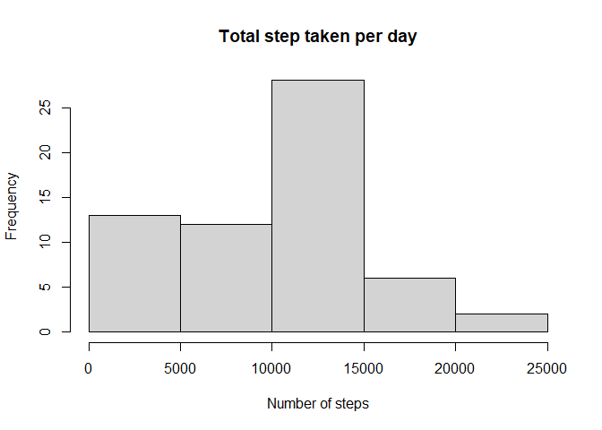
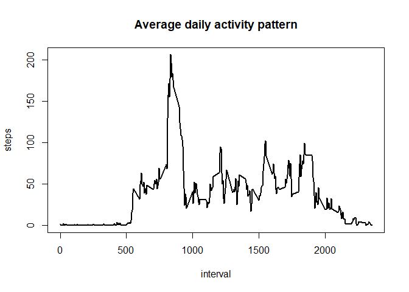
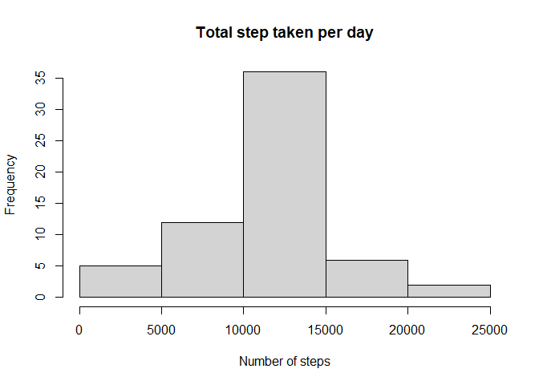
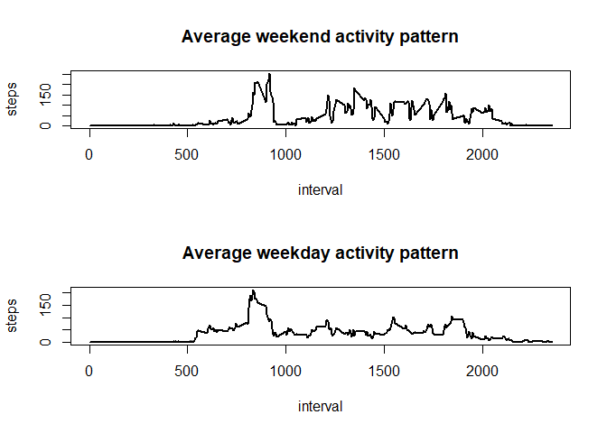

## Loading and preprocessing the data

Always use fread() function because read.csv() don't read all colums of the csv and i don't know why


```r
library(data.table)
df<-fread("activity.csv")
```


## What is mean total number of steps taken per day?
To calculate the number of steps, i used aggregate function,
getting a new dataframe with the sum of all steps per day


```r
df2<-aggregate(df$steps,by=list(df$date),FUN=sum,na.rm=TRUE)
names(df2)<-c("day","Number_Steps")
```

The histogram show the frequency of the total steps per day


```r
hist(df2$Number_Steps,main="Total step taken per day",xlab="Number of steps")
```

<!-- -->

```r
sum<-summary(df2)
```

With this, we have **Median :10395  ** and **Mean   : 9354  **


## What is the average daily activity pattern?

The average daily activity pattern is the mean of steps agrouped by
the interval given

The next plot, show the average of steps by interval

```r
interval<- aggregate(df$steps,by=list(df$interval),FUN=mean,na.rm=TRUE)
names(interval)<-c("interval","steps")

plot(interval$interval,interval$steps,type="l",main="Average daily activity pattern",xlab="interval",ylab="steps",lwd=2)
```

<!-- -->

```r
maximo_intervalo<-interval[which.max(interval$steps),]
```

The interval with the maximum number of steps is **835**.

## Imputing missing values

We need to check if the data have NA's 
Only need to count all rows with that valuea

```r
# Calculate total rows with NA
mal<-sum(is.na(df$steps))

t<-sum(is.na(df$date))
```
Now we know that are **0** NA's

In previous step we obtained the mean of each interval, so the nex step will be 
put the mean of the interval where are NA

```r
# We have the mean of each interval, so we'ññ put the mean in the interval with NA
filled<-df

for(i in 1:length(filled$steps)){
      if(is.na(filled$steps[i])){
        filled$steps[i]<-interval[interval$interval == filled$interval[i],"steps"]

      }
}
```

After set new values in NA's places, let's check if this make any change of our
previous results


```r
df2<-aggregate(filled$steps,by=list(filled$date),FUN=sum)

names(df2)<-c("day","Number_Steps")

# Now df2 is an databframe that contains dates and total steps per day
hist(df2$Number_Steps,main="Total step taken per day",xlab="Number of steps")
```

<!-- -->

We can see that change the limit of steps, but the pattern not.


## Are there differences in activity patterns between weekdays and weekends?

Before analyze data, we need put a new column with the "weekend" and "weekday" values

```r
filled$day_type<-weekdays(filled$date)
filled$day_type[filled$day_type %in% c("sábado","domigo")]<- "weekend"
filled$day_type[filled$day_type != "weekend"]<- "weekday"
```

Now, only need two segmentations to show a easy understandable plot

```r
filled<-aggregate(filled$steps,by=list(filled$interval,filled$day_type),FUN=mean)


names(filled)<-c("interval","day_type","steps")
par(mfrow=c(2,1))
with(filled,{
            plot(filled$interval[filled$day_type=="weekend"],filled$steps[filled$day_type=="weekend"],type="l",lwd=2,main="Average weekend activity pattern",xlab="interval",ylab="steps")

            plot(filled$interval[filled$day_type=="weekday"],filled$steps[filled$day_type=="weekday"],type="l",lwd=2,main="Average weekday activity pattern",xlab="interval",ylab="steps")

})
```

<!-- -->
